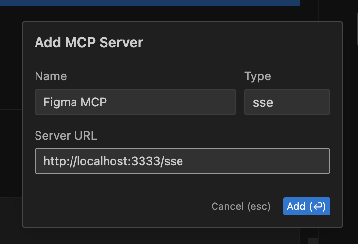
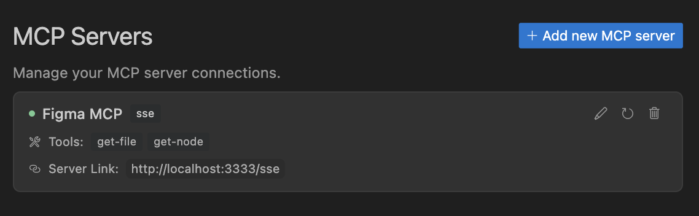
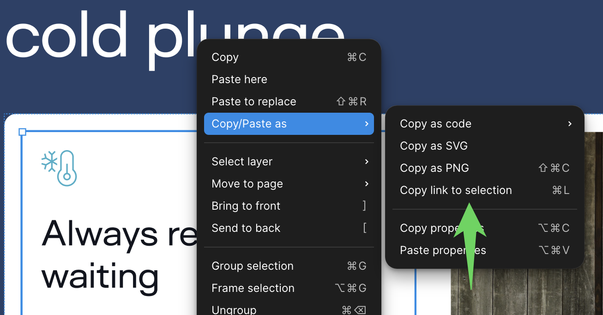

# Figma MCP Server

Give [Cursor](https://cursor.sh/) access to your Figma files with this [Model Context Protocol](https://modelcontextprotocol.io/introduction) server.

When Cursor has access to Figma design data, it's **way** better at one-shotting designs accurately than alternative approaches like pasting screenshots.

## Demo Video

[Watch a demo of building a UI in Cursor with Figma design data](https://youtu.be/6G9yb-LrEqg)
[](https://youtu.be/6G9yb-LrEqg)

<a href="https://glama.ai/mcp/servers/kcftotr525"></a>

## How it works

1. Open Cursor's composer in agent mode.
1. Paste a link to a Figma file, frame, or group.
1. Ask Cursor to do something with the Figma file—e.g. implement a design.
1. Cursor will fetch the relevant metadata from Figma and use it to write your code.

This MCP server is specifically designed for use with Cursor. Before responding with context from the [Figma API](https://www.figma.com/developers/api), it simplifies and translates the response so only the most relevant layout and styling information is provided to the model.

Reducing the amount of context provided to the model helps make the AI more accurate and the responses more relevant.

## Installation

1. Clone the repository
2. Install dependencies with `pnpm install`
3. Copy `.env.example` to `.env` and fill in your [Figma API access token](https://help.figma.com/hc/en-us/articles/8085703771159-Manage-personal-access-tokens). Only read access is required.

## Connecting to Cursor

### Start the development server

```bash
> pnpm dev
# Initializing Figma MCP Server in HTTP mode on port 3333...
# HTTP server listening on port 3333
# SSE endpoint available at http://localhost:3333/sse
# Message endpoint available at http://localhost:3333/messages
```

### Connect Cursor to the MCP server

Once the server is running, [connect Cursor to the MCP server](https://docs.cursor.com/context/model-context-protocol) in Cursor's settings, under the features tab.



After the server has been connected, you can confirm Cursor's has a valid connection before getting started. If you get a green dot and the tools show up, you're good to go!



### Start using Composer with your Figma designs

Once the MCP server is connected, **you can start using the tools in Cursor's composer, as long as the composer is in agent mode.**

Dropping a link to a Figma file in the composer and asking Cursor to do something with it should automatically trigger the `get_file` tool.

Most Figma files end up being huge, so you'll probably want to link to a specific frame or group within the file. With a single element selected, you can hit `CMD + L` to copy the link to the element. You can also find it in the context menu:



Once you have a link to a specific element, you can drop it in the composer and ask Cursor to do something with it.

## Inspect Responses

To inspect responses from the MCP server more easily, you can run the `inspect` command, which launches the `@modelcontextprotocol/inspector` web UI for triggering tool calls and reviewing responses:

```bash
pnpm inspect
# > figma-mcp@0.1.0 inspect
# > pnpx @modelcontextprotocol/inspector
#
# Starting MCP inspector...
# Proxy server listening on port 3000
#
# 🔍 MCP Inspector is up and running at http://localhost:5173 🚀
```

## Available Tools

The server provides the following MCP tools:

### get_file

Fetches information about a Figma file.

Parameters:

- `fileKey` (string): The key of the Figma file to fetch
- `depth` (number, optional): How many levels deep to traverse the node tree

### get_node

Fetches information about a specific node within a Figma file.

Parameters:

- `fileKey` (string): The key of the Figma file containing the node
- `nodeId` (string): The ID of the node to fetch
